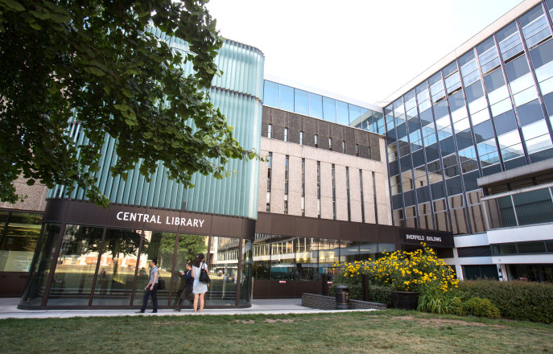

================
Academic Support
================

Support for Academic Transition
===============================

Students who join Imperial are all academically able, but they come from a wide range of secondary education cultures. Adjusting to the challenge of higher education can be tough, and we offer some special resources to support you.

First and foremost, please take time to explore the new Imperial Success Guide site. This was put together from a vast amount of collective experience — above all that of many students who were asked what was needed to empower and support them as they started university. The guide brings together information on effective study, assessments and feedback, wellbeing, workshops and support to ensure that you know where to look for advice and guidance on study skills.

.. raw:: html

  

  <a class="btn btn-info btn-custom" href="https://www.imperial.ac.uk/students/success-guide/" role="button" style="margin-bottom:20px;">The Imperial Success Guide</a>

English Classes
===============

The undergraduate course involves a substantial amount of reading and writing, as well as oral presentations. Fluency in English is vital if you are to be successful in the course. The Centre for Academic English runs a series of English classes in the evenings for students who need tuition and practice.

.. raw:: html

  

  <a class="btn btn-info btn-custom" href="http://www.imperial.ac.uk/academic-english" role="button" style="margin-bottom:20px;" style="margin-bottom:20px;">Centre for Academic English</a>

.. important:: Failure to attend these classes could result in you not understanding the lectures and failing the year’s assessments (i.e. projects, end-of-Term exams, essays and reports, etc.)

Imperial Horizons
=================

Looking to get the most out of your degree? Imperial Horizons is a programme designed to broaden your undergraduate education, inspire your creativity and enhance your professional impact. The courses are popular and highly rated by students: make your choice and sign up quickly!

You can choose from more than 20 different course options in the following four fields of study:

- Business & Professional Skills
- Global Challenges
- Science, Culture and Society
- Languages and Global Citizenship

**Key benefits**

- Give yourself a unique edge - These courses will give you opportunities to develop your skills in communication, problem-solving and teamwork.
- Make your degree transcript stand out - Imperial Horizons courses are included on your degree transcript as a valuable selling point for employers.

**Study for free during normal teaching hours** - All Departments have set aside time for Imperial Horizons:

- 1st Years: 16.00-18.00 on Tuesdays
- 2nd Years: 16.00-18.00 on Mondays
- 3rd / 4th Years: 16.00-18.00 Thursdays

.. important:: First years must register their course preferences on the Imperial Horizons website during Welcome Week, before the deadline of Monday 10th October 2016. Imperial Horizons is a set of extracurricular and non-compulsory activities that are not credited towards your degree.

.. raw:: html

  

  <a class="btn btn-info btn-custom" href="http://www.imperial.ac.uk/horizons" role="button" style="margin-bottom:20px;">Imperial Horizons</a>

Disability Advisory Service
===========================

The Disability Advisory Service (DAS) works with individual students, no matter what their disability or level of study, to ensure that they have the support they need. Our Advisors are committed to providing the best possible support for all students at Imperial College.

They understand that each person’s disability can affect them in different ways and therefore the support offered is flexible and tailored. We can also help if you think that you may have an unrecognised study issue or specific learning difficulty such as dyslexia. The Service is confidential and information about your support needs is only passed on to others within the College with your agreement and then only in order that you are fully supported. Our Advisors never pass on information outside the College or to parents unless you ask them to. DAS is also here to support students who may have a temporary or short term disability.

Some of the sorts of things the Disability Advisors can help with are:

- checking that your evidence of disability is appropriate and up-to-date
- arranging a diagnostic assessment for specific learning difficulties
- making recommendations for additional exam arrangements, for example extra time or rest breaks
- arranging extra Library support and access to the Assistive Technology Suite
- supporting applications, where appropriate, for continuing accommodation after your first year.

Your advisor will draw up a “Suggested Reasonable Adjustment” document for you to share with your department which outlines all your support needs and we will fund any additional support agreed by your DAS Advisor. This could include funding for:

- note taking, specialist study skills or mentoring support.
- disability related equipment (NOT computers)
- other additional support, for example taxi fares for those who need help with transport.

A disability is any long-term condition that has a substantial impact on your ability to study effectively for example:

- a specific learning difficulty, e.g. dyslexia, dyspraxia
- an enduring mental health condition, e.g. depression, OCD, generalised anxiety disorder etc
- a visual, hearing, or other sensory impairment
- a long-term medical condition, e.g. IBS, ME, diabetes
- a social/communication difficulty, e.g. autistic spectrum/Asperger’s syndrome
- a mobility or dexterity impairment.

You can book an appointment by dropping in to the office, phoning or sending an email:

| The Disability Advisory Service
| Room 566, Level 5, Sherfield Building
| 020 7594 9755
| disabilities@imperial.ac.uk
|

.. raw:: html

  

  <a class="btn btn-info btn-custom" href="http://www.imperial.ac.uk/disability-advisory-service/" role="button" style="margin-bottom:20px;">Disability Advisory Service</a>

Departmental Disability Officers (DDOs)
=======================================

Departmental Disability Officers are your first point of contact. They can apply for additional exam arrangements on your behalf, and will facilitate support within your Department.

The School has two Disability Liaison Officers. Depending on the year your joined us, one of them will be your main contact.

.. tip:: You can find the DDO responsible for your year group in the Key Contacts :ref:`disability-officers` section.

More information on Departmental Disability Officers is available at:

.. raw:: html

  

  <a class="btn btn-info btn-custom" href="#" role="button" style="margin-bottom:20px;">College DDO Information</a>

.. todo:: The above link currently does not work but will be updated soon.

More information on procedures for the consideration of additional exam arrangements in respect of disability is available at:

.. raw:: html

  

  <a class="btn btn-info btn-custom" href="http://www.imperial.ac.uk/student-records-and-data/for-current-students/undergraduate-and-taught-postgraduate/exams-assessments-and-regulations/additional-exam-arrangements-in-respect-of-disability/" role="button" style="margin-bottom:20px;">Exam arrangements and disability</a>

Evening Classes
===============

The Centre for Co-curricular Studies offers evening classes in a broad selection of subjects outside science and technology, such as languages and humanities. Fees are normally due, but these will be considerably less than the equivalent classes from a private company.

.. raw:: html

  

  <a class="btn btn-info btn-custom" href="https://www.imperial.ac.uk/evening-classes/" role="button" style="margin-bottom:20px;">Information on evening classes</a>

Central Library
===============

The College’s Central Library is next to the Sherfield Building. It provides access to high quality resources including electronic journals, databases, textbooks, print journals and maps. PCs and wireless access to the College computing network are also available.

Much more information is available on the library’s website, and you will be given an induction course during the first week of term. Like every other department, we have a School Librarian to guide and support your access to central library resources.

The School librarian maintains a web page with a blog. They also have office hours for consultation (see the web page for details).

| Nicole Urquhart - Design Engineering Librarian
| Room 110 Central Library
| Ext. 41889
| n.urquhart@imperial.ac.uk
|

.. raw:: html

  

  <a class="btn btn-info btn-custom" href="http://www.imperial.ac.uk/admin-services/library/subject-support/design-engineering/" role="button" style="margin-bottom:20px;">School Librarian</a>
  <a class="btn btn-info btn-custom" href="http://www.imperial.ac.uk/admin-services/library/" role="button" style="margin-bottom:20px;">College Library</a>
  

