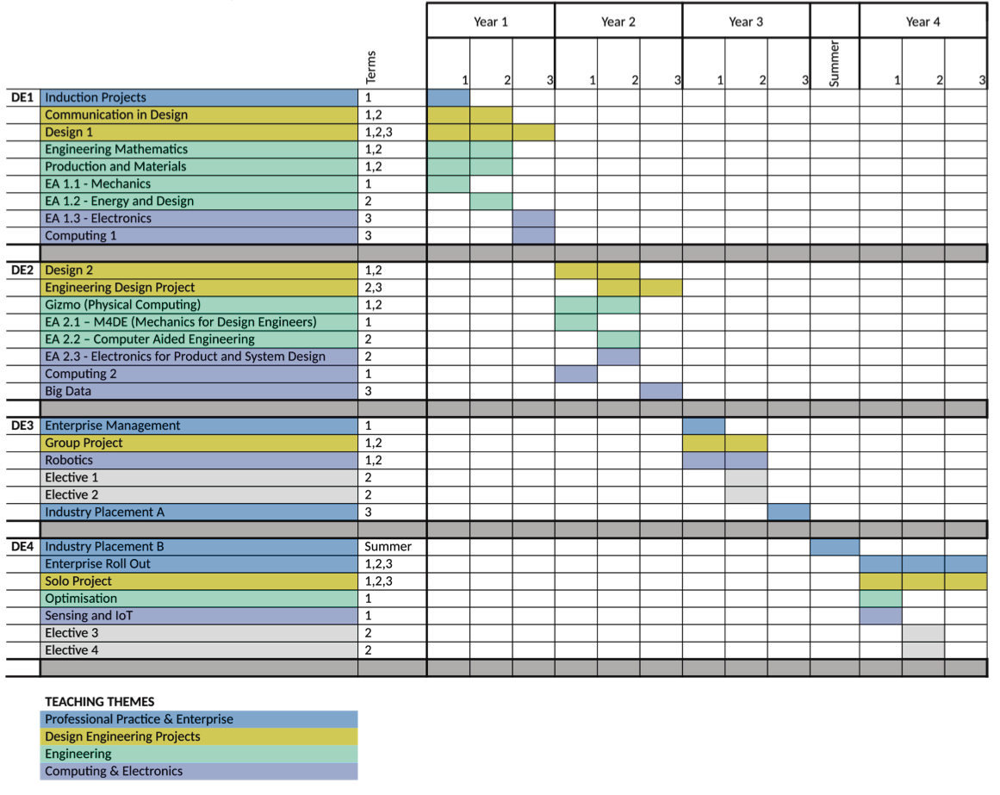
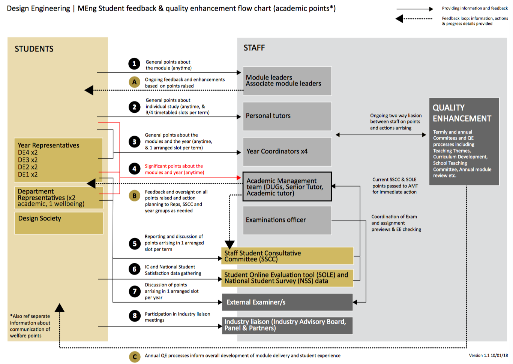
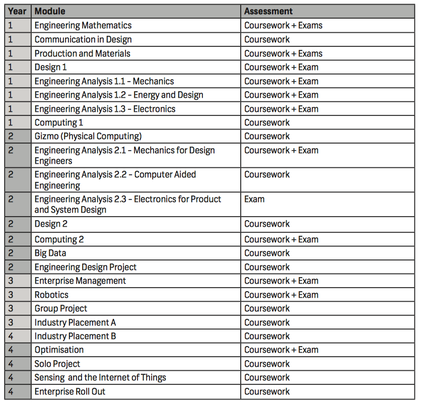

==========
Appendices
==========

.. _`appendix-map`:

Campus Map
==========

.. raw:: html

  

  <a class="btn btn-info btn-custom" href="https://www.imperial.ac.uk/media/imperial-college/visit/public/SouthKensingtonCampus.pdf" role="button" style="margin-bottom:20px;white-space:normal;">Map of South Kensington Campus</a>
  

.. _`appendix-module-gantt`:

Programme Module Gantt Chart
============================

Student Feedback Chart
======================

Assessment methods
==================

.. _`appendix-honours`:

Scheme for the Award of Honours
===============================

.. todo:: Scheme for the Award of Honours

.. _`appendix-wellbeing-rep`:

Roles and responsibilities of Wellbeing Reps
============================================

.. todo:: Roles and responsibilities of Wellbeing Reps

.. _`appendix-laptop-purchase`:

Advice and FAQ on Laptop Purchases
==================================

.. todo:: Advice and FAQ on Laptop Purchases

.. _`appendix-laptop-loan`:

Laptop Loan System
==================

.. todo:: Laptop Loan System

.. _`appendix-adobe`:

Adobe Creative Cloud License Arrangement
========================================

.. todo:: Adobe Creative Cloud License Arrangement
