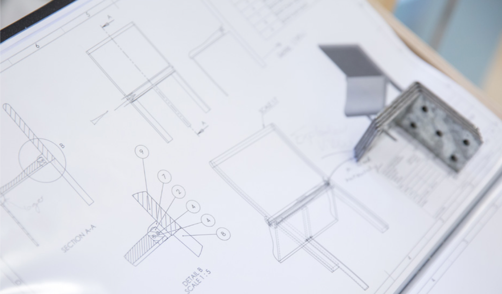

==========
Assessment
==========

Passing the Year
================

The Design Engineering MEng programme consists of four successive, one-year parts. You must pass all of the modules in one year to automatically pass onto the next year.

To pass a module, you must achieve a 40% weighted average for the entire module (so, you could get less than 40% for coursework, but then compensate that with a good exam or vice versa).

Mitigating Circumstances
========================

Circumstances beyond your control may affect your academic performance. This includes anything that means you –

- miss an exam
- miss an assessed presentation
- submit coursework late
- do not do as well on an assessment as you would do otherwise

You are advised to inform the Senior Tutor/ your Personal Tutor of any problems affecting your academic performance as soon as you can.

Submitting a Mitigating Circumstances Form (MC Form)
----------------------------------------------------

If you want the School to take these circumstances into account, you must submit a **MC Form within 5 working days of the assessment date/deadline**.

1. **All requests for mitigation should be made on the relevant form**:

  a. For major examinations, pieces of coursework and projects, and difficulties impacting upon a substantial part of the academic year, use form marked ‘MAJOR’.

  b. For minor examinations, pieces of coursework and projects, use form marked ‘MINOR’.

  See the next section for guidance on which form to complete. If you are still uncertain which form is appropriate, you should talk to your Personal Tutor.

2. **Complete the form with as much detail as you can.** Look at the example MC Forms on BlackBoard if you are uncertain about anything. Don’t forget to date and sign the form.

  a. For Major Assessments only – along with your form you need to provide proof of your circumstances. The burden of proof is on you.

3. **Return the form and any supporting evidence** to the Teaching Office either in-person (Third Floor Dyson Building) or via email (a.marsh@imperial.ac.uk)

.. important:: College policy requires that any details you provide remain confidential as far as possible.

Major or Minor assessment?
--------------------------

The MC Form you submit depends on whether the missed assessment is ‘Major’ or ‘Minor’. The following is a guideline. If you are still uncertain which form is appropriate, you should talk to your Personal Tutor, Senior Tutor, or Director of the Programme.

**Minor Assessments** are equivalent to **one ECTS or less** are considered minor.

**Major Assessments** are equivalent to **more than one ECTS** are considered major.

The ECTS credits allocated to **each module** can be found in :ref:`appendix-module-gantt`.

You then need to look up what **percentage of the module** your assessment is. This will be in the module handbook, available in the relevant module section of Blackboard.

What happens after I submit the MC Form?
----------------------------------------

**If your request is time sensitive** - For example, if you need permission to miss an exam for a funeral or you need an extension to your coursework deadline – then the mitigating circumstances panel will make a decision as soon as possible. They will reply to you within ten working days of the receipt of all required documentation.

**If your request is NOT time sensitive** - For example, you have already missed your exam or you think your presentation could have been better – then your case will be considered at the termly Mitigating Circumstances Panel.

The Mitigating Circumstances Panel meet threes time a year:

- Second week of Term 2 (for Term-1-related cases)
- Second week of Term 3 (for Term-2-related cases)
- First week of Summer holidays (for Term-3-related cases)

You will hear the Panel’s decision within five working days of the panel meeting.

.. important:: The College Health Centre can certify illness only for absence from College lasting more than one week, or absence from an Examination. Submit the form as soon as you can.

Mitigating Circumstances forms are in the ‘UG Resources’ section of Blackboard

.. button::
   :text: Mitigating Circumstances Forms on BlackBoard
   :link: https://bb.imperial.ac.uk/webapps/blackboard/content/listContentEditable.jsp?content_id=_676549_1&course_id=_7973_1&mode=reset

Getting Your Results
====================

Your results will be loaded onto your eService in early-mid July.

If you are a sponsored student and need your exam results sent to your sponsor, please contact the Student Hub (**Level 3, Sherfield Building**) and they can arrange this for you.

When all assessments for the year have been marked and the marks collated, a series of meetings collectively known as the Board of Examiners — review the results and allocate an overall grade to each student.

Generally candidates who do not satisfy the examiners, either in the examinations or after Supplementary Qualifying Tests, will be required to withdraw from the College permanently.

In exceptional circumstances, a student might be allowed to retake the year.

Appeal and Complaints Procedures
================================

We have rigorous regulations in place to ensure assessments are conducted with fairness and consistency.

In the event that you believe that you have grounds for complaint about academic or administrative services, or wish to appeal the outcome of an assessment or final degree, we have laid out clear and consistent procedures through which complaints and appeals can be investigated and considered.

.. button::
   :text: Appeal and Complaints Procedures
   :link: http://www.imperial.ac.uk/about/governance/academic-governance/academic-policy/complaints-appeals-and-discipline/

Supplementary Qualifying Tests (SQTs/resits)
============================================

In the case of a fail in one or two modules the Board of Examiners may set a Supplementary Qualifying Test (SQT).

This course of action is only available where the performance in on other modules is very good.

You are not guaranteed to be allowed to sit an SQT.

SQTs can take the form of an examination or coursework. The decision on the format is made by the module leader and designed to ensure that the module learning outcomes are achieved.

Students can take a maximum of 2 SQTs per year for the first three years of the course.

No SQTs are allowed in the final year.

SQTs are usually done in the summer (generally early September).

**Any modules that have been passed due to an SQT will be capped to 40%.**

.. important:: SQTs must be taken at Imperial College London. The College cannot make arrangements for them to be taken abroad.

.. note::
  More information on SQTs can be found in the Appendix: :ref:`appendix-honours`.

Retaking a Year
===============

Retaking a year that you have failed is only permitted in exceptional circumstances.

The decision on whether or not you will be allowed to retake will be made at the Board of Examiners (in July) or after a failed SQT.

If permission is granted for you to retake a year then you will be expected to start the year again from the start (October) and complete it in full. All of your grades from your previous attempts at that year will be discarded, including any modules that you may have passed. Your grades for any years you successfully passed previously will be unaffected.

Plagiarism
==========

Plagiarism is the presentation of another person’s thoughts, words, images or diagrams as though they were your own.

If any significant level of plagiarism is detected in any submission, the best possible outcome will be a mark of zero.

.. important:: College treats plagiarism and cheating offences very seriously indeed.

Compulsory Lecture
------------------

In the sixth week of term you will hear a lecture on plagiarism by a representative of the College Library. **Attendance at this lecture is compulsory.**

TurnItIn
--------

The School uses the plagiarism detection site TurnItIn both to filter electronic submissions of coursework via Blackboard and to check electronic duplicates of printed submissions.

.. button::
   :text: Student Guide to TurnItIn
   :link: http://www.imperial.ac.uk/admin-services/ict/self-service/teaching-learning/elearning-services/turnitin/

.. button::
   :text: College Plagiarism Information
   :link: http://www.imperial.ac.uk/admin-services/library/learning-support/plagiarism-awareness/undergraduates/

Coursework
==========

The purpose of coursework is to develop your design engineering skills, reinforce lecture material and to develop specific skills in laboratory work, computing, design etc. Most coursework is assessed and contributes towards your degree.

Coursework includes project work, prototypes, presentations, lab reports, project reports, computing exercises and progress tests which are completed and handed in during the year.

.. important:: Do not under any circumstances use any copied or pirated coursework, or allow your work to be copied by others.

   The College treats cheating on coursework exercises exactly the same way as cheating in examinations. If any student is suspected of cheating, of attempting to cheat, or of assisting someone else to cheat, the facts will be reported to the College. If found to have done so, s/he may in consequence be disqualified from all future examinations of the Imperial College.

.. button::
   :text: College Disciplinary Procedures
   :link: http://www.imperial.ac.uk/media/imperial-college/administration-and-support-services/registry/academic-governance/public/regulations/2014-15/student-regs/Regulations-for-Students.pdf

Late Submission of Coursework
-----------------------------

Each piece of coursework will have a specified submission date, set in advance and published in the module description.

.. important:: **Coursework submitted between one minute and 24 hours late will be capped at 40%.**

  **Coursework submitted more than 24 hours late will receive 0%.**

  The 24-hours late submission policy does not apply in the following cases, in which any late coursework will be marked 0%:

  - Class tests
  - Submitting of results/write up from a lab session at the end of the session
  - Time limited computer programming exercises
  - Outputs from design days/weeks/activities
  - Work created from workshop sessions (e.g.. where something is made in a given time)
  - Measurements, notes, annotated maps etc.., undertaken in the field

Having a major coursework item capped or zeroed due to late submission could lead, in the worst case, to a lower degree classification or even total failure.
You should allow for potential delays such as computer/ internet/printer glitches or delays to your journey when planning your coursework submissions.

.. important:: Some coursework will be submitted electronically via Blackboard. Once you have submitted your work on Blackboard, Blackboard will provide you with a preview of the file you have submitted. It is your responsibility to ensure that you have submitted the correct file. If you submit the wrong file in error and subsequently miss the coursework deadline, your work will be marked as late and you will receive 40 % or 0% for the work (depending on when the error is spotted by you).

Missed coursework
-----------------

If your coursework is more than two weeks late, it will be counted as ‘missed coursework’. Missed coursework will receive 0% and will not be marked for feedback even if it is submitted at a later date.

Moderation
----------

Major items of coursework are double marked. The moderation process is intended to ensure fair and accurate marking and to resolve discrepancies in project report marks between the supervisor and the second marker.

Feedback to Students
--------------------

The principal objectives of setting coursework are to assess your progress and to help you improve.

The School has a target of 10 **working** days for coursework to be marked and returned to you.

Sometimes circumstances mean that an academic will not be able to achieve this turn-around but they will always notify you if this is the case.

The form of feedback you receive will vary widely, depending on the nature of the submission. A common form is an itemised list of criteria with a tick-box grade for each, along with some written indication of the reason for credit being lost.

Examinations
============

Most written examinations take place at the start of the term following a module or at the end of the summer term. They will appear in your timetable.

There is no set ‘failure rate’ for exams and therefore no reason why every candidate should not pass at the first attempt.

Past Papers
-----------

Normally, each examined module provides at least the last two exam papers, with answers or outline solutions, on Blackboard. These provide a useful guide for paper and question style, but cannot be relied on to guide your revision.

Defining what you must be able to do in an exam is the job of the intended learning outcomes given in the module description.

Exam Advice
-----------

The Imperial Success Guide provides excellent advice on taking university exams.

You should refer to this information regularly.

.. button::
   :text: The Imperial Success Guide
   :link: https://www.imperial.ac.uk/students/success-guide/

Exam Stress
-----------

Most people find exams at least a bit stressful. We suggest that you refer to the College Health Centre’s website for advice on how to manage stress.

If you find that you are becoming overwhelmed by stress, there is help available for you.

.. button::
   :text: Health Centre Advice on Exam Stress
   :link: https://www.imperialcollegehealthcentre.co.uk/exams-and-stress/

Sitting an Exam
---------------

Your exams will be in your timetable. It will include all of the information that you require including time, date and locations of exams.

.. important:: You must carry your college identity card, so that your CID number can be noted and your identity checked.

The only items you can take into exams are:

- **Pens, pencils, erasers and rulers**. These must either be loose or in a transparent pouch.
- **Your college identity card**. This must be placed on your desk so that your CID is visible to be noted and your identity checked.
- **Still water** in a clear plastic bottle with no label.
- You will be provided, if necessary, with:
  - **A basic scientific calculator** — you will not be allowed to take your own, or any peripheral equipment. The Casio FX–83ES provided has all the usual scientific functions. If you need to familiarise yourself with this model, the UG Office will issue one on overnight loan (don’t leave this until the last-minute rush).

Other than water in a clear plastic bottle with no label, there is to be no eating or drinking during the exam.

College examination conditions and rules — e.g. the absolute rule against speaking to neighbours — are stated in the Instructions to candidates for examinations and are similar to those for any other public exams.

.. important:: No smart watches or (other watches with functions beyond telling the time) will be allowed in the examination room. There will be at least one clock in each examination room.

.. button::
   :text: Instructions to Candidates for Examinations
   :link: http://www.imperial.ac.uk/media/imperial-college/administration-and-support-services/registry/academic-governance/public/academic-policy/exam-arrangements-and-re-sits/Instructions-to-candidates-for-examinations.pdf

.. button::
   :text: Handy Exam Guidance
   :link: http://www.imperial.ac.uk/students/success-guide/ug/assessments-and-feedback/examinations/sitting-examinations/

.. important:: The instructions on the front page of the answer book fill in a list of questions attempted, start each question on a new page etc. — are there for your protection. Read and obey them!

Consideration of Additional Examinations Arrangements in Respect of Disability
------------------------------------------------------------------------------

Additional assessment and examination arrangements are provided by the College for individual candidates registered as students of the College who have physical, mental or sensory impairments (whether temporary or permanent) or specific learning difficulties. For further details, please read below.

You should contact the School’s :ref:`disability-officers` if you believe that you are eligible for such arrangements.

.. button::
   :text: Procedures for consideration of exam arrangements in respect of Disability
   :link: https://www.imperial.ac.uk/media/imperial-college/administration-and-support-services/registry/academic-governance/public/academic-policy/exam-arrangements-and-re-sits/Exam-arrangements-in-respect-of-disability.pdf

Examination Feedback
--------------------

As soon as you submit an exam script for marking, it becomes the property of the College and you renounce any right to access it.

.. important:: There is no automatic right of appeal against the marks awarded at examination. Students may only appeal against exam results on the grounds of administrative or clerical error and papers will not be remarked.

Each paper is marked by two independent internal examiners, and checked by one external examiner.

Students have the right (on payment of a fee) under the Data Protection Act to sight of any such written comments or annotations. Request must be made to the College Secretariat, with payment of a fee, and annotations will then be transcribed to a separate document for access under carefully supervised conditions.

Grades & Marks for Exams & Coursework
=====================================

Imperial assesses undergraduate examinations and coursework submissions on a scale of correspondence between percentage mark, letter grade A to E and degree honours class.

**All grades and numerical marks issued during the academic year are provisional.** They are issued to provide feedback and to provide an indication of progress.

Final marks are awarded only after work has been the Board of Examiners has convened (in July).

Ultimately these marks, appropriately weighted, will be used to determine which degree class is awarded.

These correspondences are shown the Table below.

+--------+----------------+-------------------------+
| Grade  | ...corresponds | ...corresponds          |
| Letter | to mark (%)    | to degree class         |
+========+================+=========================+
| A*     | 85+            | First class             |
+--------+----------------+ honours                 |
| A      | 70-84          |                         |
+--------+----------------+-------------------------+
| B      | 60-69          | 2.1 honours             |
+--------+----------------+-------------------------+
| C      | 50-59          | 2.2 honours             |
+--------+----------------+-------------------------+
| D      | 40-49          | Third class honours     |
+--------+----------------+-------------------------+
| E      | below 40       | Not up to honours level |
+--------+----------------+-------------------------+

Student Prizes and Awards
=========================

All internal and external awards available to Design Engineering students will be advertised on Blackboard.

The Dean’s List
---------------

Because Imperial graduates compete in an international market, Imperial has matched the USA practice of recognising the top 10% of A-graded students on a ‘Dean’s list’ — and marking this achievement on the transcript of graduating students.

The conditions are:

- Achieving an overall mark of 70% or greater during the previous 12 months, and
- Being placed within the top 10% (rounded up) of students in their cohort — e.g., of their year and programme.

DESIRE (Design Engineering Selected Innovation REward)
------------------------------------------------------

The DESIRE award is a prestigious award within the School. It is something that all students should aspire to win during their degree and it will appear on transcripts of the awardees.

Please note that the DESIRE selected works need not necessarily be associated with the top mark or grade scoring project.

**Which projects get DESIRE awards?**

Not all projects qualify for the DESIRE award. It is only for modules where there is a design engineering output in the form of significant coursework. The project could be a group project or an individual piece of work.

**Selection for the DESIRE award**

The selection of the winner may be done on the day of the assessment or after the completion of the assessment.

The selection will be done by a panel of Design Engineering experts with substantial experience in the unique aspects being assessed for the award.

The chair of the panel will be the module leader.

If the panel decide that none of the submitted work demonstrates significant outstanding quality, then the award will not be issued. This is to retain the quality of the award winning projects.

Winning projects are listed on the School’s award webpage:

.. button::
   :text: DESIRE Awards
   :link: http://www.imperial.ac.uk/design-engineering/study/meng/desire/
