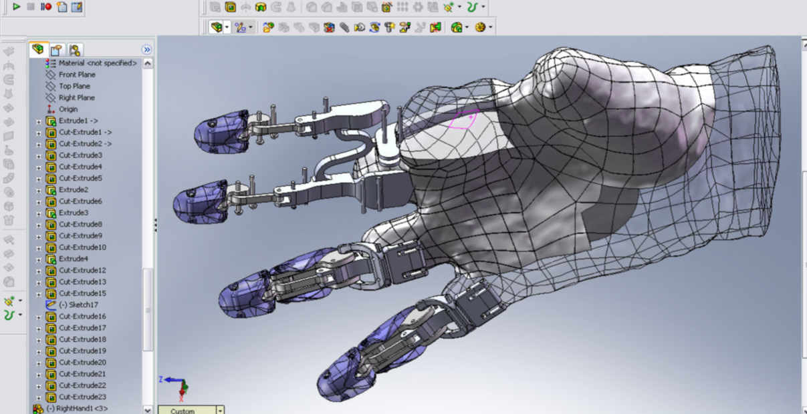
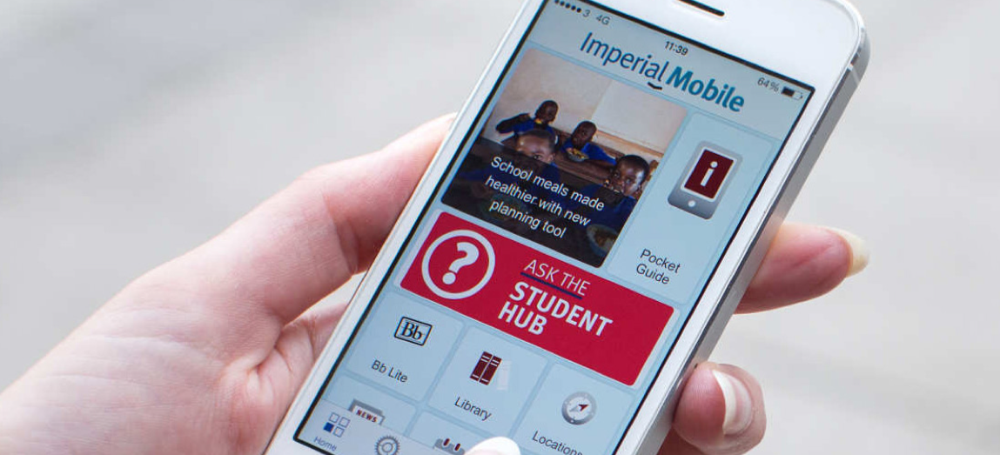

=========
Computers
=========

.. todo:: This page will be updated to reflect the latest advice from Professor Peter Cheung, who is in charge of the Department Computer policy.

Required Laptop
===============

In order to undertake the MEng in October 2018, you will need to have a laptop computer of the following minimum specification for classes and coursework:

- Windows 10 capable
- Intel i5/i7 6th/7th generation processor
- 16 GB RAM
- 256 GB SSD HDD
- NVIDIA K1100M or higher graphics card

More details and advice on laptop purchasing is in :ref:`appendix-laptop-purchase`.

Regular maintenance
-------------------

You will be responsible for basic laptop upkeep of your laptop. You must arrange:

- Virus protection
- Ransomware protection
- Regular security updates
- Back-up your data

It is recommended that at least once a year you take your laptop to ICT for a ‘wipe-out’ to restore the laptop’s original performances.

.. raw:: html

  

  <a class="btn btn-info btn-custom" href="http://www.imperial.ac.uk/admin-services/ict/self-service/be-secure/" role="button" style="margin-bottom:20px;white-space:normal;">College IT Security Advice</a>
  <a class="btn btn-info btn-custom" href="http://www.imperial.ac.uk/admin-services/ict/new-to-imperial/students/" role="button" style="margin-bottom:20px;white-space:normal;">ICT Resources for new students</a>

Imperial College Laptop Surgery
-------------------------------

If you have a non-School laptop and have software issues, you can take it to the College’s Laptop Surgery.

.. button::
   :text: College Laptop Surgery
   :link: https://www.imperial.ac.uk/admin-services/ict/training-and-resources/laptop-surgery/

Students who joined 2015-17: what to do if your School Laptop breaks
--------------------------------------------------------------------

If you were issued a School laptop and it breaks, take it to ICT on the first floor of Central Library (opening hours can be seen in `ICT Access`_).

They will take the laptop from you and contact you when it is fixed. If it cannot be fixed, a new one will be provided under the warranty.

.. important:: If possible, back-up all your files before taking it to ICT.

School Laptop Library
=====================

The Department has 36 laptops that you may borrow for a 4-hours at a time. These laptops are stored in secure lockers that you operate yourself using your Imperial College ID card.

These laptops will be pre-installed with all the relevant software.

The loan laptops are not be taken out of the Dyson building.

Borrowing a laptop is like borrowing a library book. If you do not return it within the due period, **an overdue fine will be incurred.**

A full guide to how the loan laptop system works is in :ref:`appendix-laptop-loan`.

College ICT Support
===================

.. important::
  Back-up your digital work regularly!

  Security breaches and hardware failure can lead to losing your work. It is your responsibility to protect against this.

Imperial College Information and Communication Technologies (ICT) provides general assistance with IT issues from a central Service Desk.

ICT Access
----------

**08.30 to 18.00, Monday to Friday**

- In-person: ICT Service Desk, 1st Floor, Central Library, South Kensington Campus
- Phone: 020 7594 9000 (extension 49000)

.. button::
   :text: 24/7 Support: ASK ICT
   :link: https://imperial.service-now.com/ict/

.. note::
  All staff and students are bound by the `conditions of use for IT facilities <https://www.imperial.ac.uk/admin-services/ict/self-service/computers-printing/campus-computers/conditions-of-use-for-it-facilities/>`_.

Software
========

The School will provide access to any software that you may need for the course. Imperial College has agreements with many companies such that students could install some software free on their own personal machine.

Please check out this web-page to see what software is available for you while being a student at Imperial:

.. button::
   :text: Software for Students
   :link: https://www.imperial.ac.uk/admin-services/ict/store/software/software-for-students/

Some packages are only available on the School’s loan laptops. To use these, you must borrow one of the loan machines and use it within the School’s building.

**Adobe Creative Cloud CC**

Adobe Creative Cloud CC (the full suite of creative software) will be installed on all the loan laptops. Additionally each DE Year Group will have access to Adobe CC on their personal laptops for one term each year.
More information on the arrangements for CC can be found in :ref:`appendix-adobe`.

Printing
========

It is possible to print to the communal college printers from your School issued private laptop. You will need your College ID card to do this.

.. button::
   :text: How to print
   :link: http://www.imperial.ac.uk/admin-services/ict/self-service/computers-printing/printing/

Printing to communal College printers and using the photocopiers costs money. You can purchase printer credits to charge your card at the Central Library or online.

Communal printers and photocopiers can be found on Level 2, Dyson building and the Central Library.

Printer credits
---------------

Undergraduate students who join the School in or after October 2018 will be issued with £10/year printing credit for use on College printers.

This will be automatically issued to your account at the start of each year.

Service Point
-------------

Some projects may require that you design a poster to present your work. Posters can be printed at Service Point, the College’s on-site contractor for bulk and professional printing.

.. button::
   :text: Service Point
   :link: https://www.imperial.ac.uk/admin-services/finance/purchasing/recommended-suppliers/by-product-type/print/

.. important::
  Ensure you allow sufficient time for the turnaround of printing tasks.

Internet Access
===============

Imperial College London provides and supports excellent access to the Internet, both on-site and in halls. However, this access is not unrestricted and its misuse, or its use for anti-social behaviour, are regarded as serious offences.

An account for access to IT facilities was created for you on registration, and you have been provided with a username and password for login and Internet access via Outlook, Internet Explorer and Firefox. If you forget your password and need to obtain a new one, you will need to produce a valid college ID card.

.. button::
   :text: How to access the College network
   :link: http://www.imperial.ac.uk/admin-services/ict/self-service/connect-communicate/wifi-and-networks/

.. important::
  In your contract as a student you have agreed to abide by the Conditions of Use of IT Services. These conditions concern anti-social behaviour by which other users can be affected and areas of misuse which come under UK Law.

  The College network extends to student halls and here, again, it is important to be aware of the restrictions imposed both by College regulations and by national law.

Imperial College Mobile App
===========================

Many College services are available through the Imperial College Mobile app.

This is available or iOS and Android and there is a web version for other devices.

We recommend that you download this app.

.. button::
   :text: Download Imperial Mobile App
   :link: http://www.imperial.ac.uk/students/online-services/mobile/

