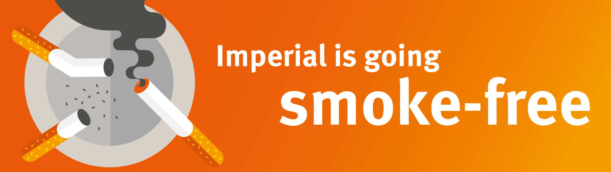

===================
General Information
===================

College Principles
==================

Imperial College London embodies and delivers world class scholarship, education and research in science, engineering, medicine and business, with particular regard to their application in industry, commerce and healthcare.

The College is diverse and international - it comprises academic staff, students and support staff of varied disciplines and backgrounds. It champions collaboration, actively opposes discrimination and recognises the importance of making a positive impact in the wider community.

The full College Principles an be found here:

.. raw:: html

  

  <a class="btn btn-info btn-custom" href="https://www.imperial.ac.uk/students/our-principles/" role="button" style="margin-bottom:20px;white-space:normal;">College Principles</a>
  

Health Services
===============

A list of College health and welfare services is posted throughout the School and College. You will probably need to make little or no use of these services, but you should register as an NHS patient with the Health Centre within the first few weeks of term.

Health Centre
-------------

The College has its own Health Centre that is only for Imperial Staff and Students. This is run by the National Health Service (NHS).

**Registration**

On the Sunday before Welcome Week, the Health Centre will be open for students in local halls of Residence to register, and to provide information on vaccinations if required. Health centre staff will also be working late sessions on Monday, Tuesday, Wednesday and Thursday of Welcome Week for new registrations and immunisations.

- **Address**: 40 Prince’s Gardens Southside, Watts Way, London, SW7 1LY
- **24-hour telephone service**: +44 (0)20 7584 6301
- **Emergencies (Security)**: 4444 (internal)
- **Emergencies (Security)**: 020 7589 1000 (external)
- **Internal extension**: 49375/6

| **Term time opening hours**
| 08.00–18.00 Monday, Wednesday, Thursday and Friday.
| 08.00–13.00 Tuesday.
|
| **Vacation time opening hours**
| 08.00–17.00 Monday, Wednesday, Thursday and Friday.
| 08.00–13.00 Tuesday.
|
| **Closed**
| At weekends and on public holidays.
|

On weekdays during the Christmas and Easter closures, the Health Centre runs an emergency clinic only, 08.00-10.00. Reception is open 08.00–13.00.

.. raw:: html

  

  <a class="btn btn-info btn-custom" href="#" role="button" style="margin-bottom:20px;white-space:normal;">Find a Doctor</a>
  <a class="btn btn-info btn-custom" href="https://www.imperialcollegehealthcentre.co.uk" role="button" style="margin-bottom:20px;white-space:normal;">Health Centre website</a>
  <a class="btn btn-info btn-custom" href="https://www.nhs.uk" role="button" style="margin-bottom:20px;white-space:normal;">National Health Service website</a>
  

.. todo:: The above link currently isn't working. It should be fixed shortly.

.. todo:: Notes/tip about Babylon will be added here.

Out of Hours Service
--------------------

If you are registered with the Health Centre as a National Health Service (NHS) patient, and need medical advice outside normal opening hours please telephone the surgery as usual. Follow the recorded instructions which explain how to contact its out-of-hours service.

The Health Centre provides a 24-hour emergency service for its NHS registered patients only.

If you are not eligible to register there, you may use its onsite services during normal working hours only. Make sure you are registered with an NHS General Practitioner near where you live during term, in case you need the doctor to visit you there or need medical advice out-of-hours.

Nearest Accident and Emergency (A&E) Departments
------------------------------------------------

- **Chelsea and Westminster Hospital**

  369 Fulham Road London SW10 9NH

- **St Mary’s Hospital**

  Praed Street, London W2 1NY

.. important:: Accident and emergency (‘A&E’) departments should only be used for **accidents and emergencies**.

Mental health services
======================

Mental Health issues are not uncommon and 1 in 4 people in the UK will experience a `mental health problem each year`_.

.. todo:: The source for the reference above will be added.

If you find that you are struggling to cope with **any** aspect of your life, it is better to seek help earlier rather than later.

Short-term counselling is offered to all registered students of Imperial College London. It is free and confidential:

.. raw:: html

  

  <a class="btn btn-info btn-custom" href="http://www.imperial.ac.uk/counselling/" role="button" style="margin-bottom:20px;white-space:normal;">College Counselling</a>
  

The above website also includes links to various resources that provide mental health information and advice.

If you are registered as an NHS patient you are also able to access free Mental Health services via the NHS although waiting times can be long.

.. important::
  If you are feeling suicidal it is very important for you to talk to someone and tell them how you are feeling. This could be a family member, a friend, a member of College staff, a health professional, a helpline or whoever you feel comfortable talking to.

  **If you are considering killing yourself right now you should contact the emergency services (999) immediately.**

.. sidebar:: "Talk to us"

  .. image:: _static/samaritans.jpg

The Samaritans is a charity organisation who provide services to those who are experiencing mental health issues. You can contact their helpline, via phone on 116 123 (free from all phones including mobile) or email jo@samaritans.org

.. raw:: html

  

  <a class="btn btn-info btn-custom" href="https://www.samaritans.org" role="button" style="margin-bottom:20px;white-space:normal;">Samaritans website</a>
  

Security
========

Imperial is a relatively public space, and, sadly, thefts do occur from time to time. It is essential to look after your own property and to remain vigilant. Take great care of both your personal property and that of the College.

If you are planning to use a bicycle in London, please be careful and lock it securely. You can find more information about this at the link below.

.. raw:: html

  

  <a class="btn btn-info btn-custom" href="#" role="button" style="margin-bottom:20px;white-space:normal;">Information Security Policy</a>
  

.. todo:: The above link currently isn't working. It should be fixed shortly.

.. important::
  If you lose anything, report it promptly to the security officer in Sherfield building (no. 20 on :ref:`campus map <appendix-map>`, internal tel. 4444). It is especially important to report a lost or stolen id card. If you find an ID card or any apparently lost property in the school, please hand it into the undergraduate office or postgraduate office.

.. raw:: html

  

  <a class="btn btn-info btn-custom" href="http://www.imperial.ac.uk/estates-facilities/security/" role="button" style="margin-bottom:20px;white-space:normal;">College Security website</a>
  <a class="btn btn-info btn-custom" href="#" role="button" style="margin-bottom:20px;white-space:normal;">Securing your bike</a>
  

.. todo:: The above link currently isn't working. It should be fixed shortly.

Your ID Card
============

The College-wide security system of ID swipe cards controls and monitors access to halls of residence, and to the School building and certain rooms outside normal hours. Your ID card will be your passport for the duration of your course: get it as soon as you can, and treat it with respect.

.. important:: Lending your swipe card to friends or acquaintances, even for a short time, is a serious offence which can result in your being asked to leave the College

.. raw:: html

  

  <a class="btn btn-info btn-custom" href="mailto:id.card@imperial.ac.uk" role="button" style="margin-bottom:20px;white-space:normal;">Contact the ID Card Office</a>
  

Student Disciplinary Procedure
==============================

The College has the right to investigate any allegation of misconduct against a student and may take disciplinary action where it decides, on the balance of probabilities, that a breach of discipline has been committed. The general principles of the Student Disciplinary Procedure are available on the College website.

.. raw:: html

  

  <a class="btn btn-info btn-custom" href="#" role="button" style="margin-bottom:20px;white-space:normal;">Student Disciplinary Procedure</a>
  

.. todo:: The above link currently isn't working. It should be fixed shortly.

Smoke-Free Policy
=================

All Imperial campuses and properties are smoke-free. This means that smoking by staff and students is not permitted on or within 20 metres of College land. The policy covers all College properties, including student accommodation and sports grounds.

.. raw:: html

  

  <a class="btn btn-info btn-custom" href="https://www.imperial.ac.uk/health-and-wellbeing/smoke-free-imperial/" role="button" style="margin-bottom:20px;white-space:normal;">Smoke-free</a>
  

Health and Safety
=================

Design engineers make things, test things and deal with potentially dangerous quantities, e.g. chemicals, power, energy, force, pressure, mass and velocity.

To be a professional engineer your consciousness of risk, and concern for your own and others’ safety, must be considered and instinctive. We will emphasise this from day one. Very soon after registration, every student must attend the School Safety Briefing.

You are responsible for looking after your own health and safety and that of others affected by your College-related work and leisure activities. You must:

- comply with all local and College policies, procedures and codes of practice and with the arrangements which the College has in place to control health and safety risks.

- ensure that your activities do not present unnecessary or uncontrolled risks to yourself or to others.

- attend appropriate induction and training.

- report any accidents, unsafe circumstances or work-related ill health of which you become aware to the appropriate person.

- not interfere with any equipment provided for Health and Safety.

- inform your supervisor or the person in charge of the activity in cases where you are not confident that you are competent to carry out a work or leisure activity safely, rather than compromise your own safety or the safety of others.

.. raw:: html

  

  <a class="btn btn-info btn-custom" href="https://www.imperial.ac.uk/safety/safety-by-topic/safety-management/health-and-safety-policy-statement/" role="button" style="margin-bottom:20px;white-space:normal;">College Health and Safety Policy</a>
  

The School's safety contact is the :ref:`safety-officer`.

.. important::
  The College is required, under the Health and Safety at Work Act (1974), to formally acquaint all its members with their legal responsibilities for the maintenance of their own safety and that of others. You must read and understand the linked Health and Safety Policy Statement, and will be required to sign a form to say that you have.

  Failure to attend the Safety Briefing will forfeit the protection offered by the Act and render you vulnerable to personal prosecution in the courts. In any event, you will certainly not be allowed to work in the School workshops and laboratories.
