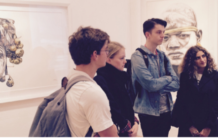

============
Key Contacts
============

School Officers
===============

Most of our academic staff and many other members
of the School are engaged in teaching, but as an
undergraduate student there are a few you will see and
hear much more of.

All staff are often away from their desks, therefore
whenever possible, you should contact the person you
wish to speak with via email ahead of time and arrange an
appointment.

.. todo:: Key contacts discovery table. Exact UX to be worked out.

Year Coordinators
=================

.. todo:: year Coordinators

Personal Tutors
===============

.. todo:: personal tutors

   Personal Tutorial visit to V&A museum - 2017

Teaching Office
===============

.. todo:: teaching office

Senior Tutor
============

The Senior Tutor is responsible for the welfare and academic progress of every undergraduate student in the School, and works with the student representatives to ensure your course is running as smoothly as possible. They can offer personal advice and help to any student on both academic and non-academic matters.

The Senior Tutor is also on call during vacations but if for any reason they are unavailable, or you are unsure about who to talk to on a particular issue, please ask any staff member in the UG Office and they will decide who is best able to help you.

One responsibility of the Senior Tutor’s team is to maintain records for each student so that, for example:

- You can be notified of your examination results
- You can provide evidence of problems such as ill health, for it to be presented to the Board of Examiners.

Your student file is strictly confidential to the Senior Tutor and his team; no-one else is allowed to consult it.

Faculty Senior Tutor
====================

In the event of an issue arising within your department there are a number of avenues for you to seek support. This will include, depending on your department, your Undergraduate Senior Tutor(s) and your personal tutor, and in some departments, other designated staff such as year tutors or degree coordinators.

There are a number of avenues within the College to seek help with academic and pastoral matters: http://www.imperial.ac.uk/student-space/.

In the event that you would like to seek additional support or guidance, or that you wish to air your issues in confidence, the Faculty Senior Tutor, Dr Lorraine Craig, can be contacted by email mailto:l.craig@imperial.ac.uk in the first instance.

Depending on the nature of your query, it may be passed onto other more relevant staff.
