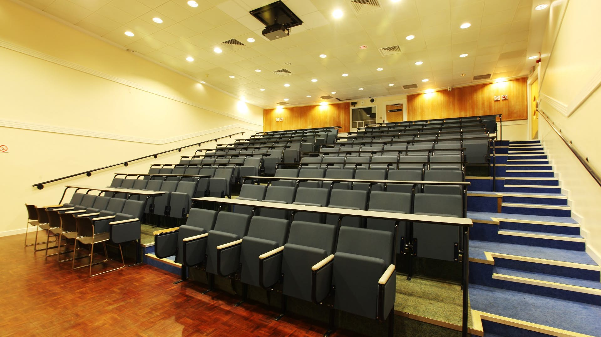

====================
School Communication
====================

Our primary channels for maintaining contact with you is via your Imperial College e-mail and by the Virtual Learning Environment (Blackboard).

Blackboard
==========

Blackboard is the Virtual Learning Environment that will be used for all Design Engineering modules.

Module information
------------------

Within Blackboard you will be able to find a section (module shell) for each of the modules you are currently enrolled in. In each module shell you will find information and materials about the specific module, such as:

- module handbook,
- recorded lectures,
- exercise and tutorial notes,
- announcements,
- tests,
- videos,
- marking scheme, etc.

**How to login**

You will be able to login into Blackboard using your Imperial College credentials (e.g. jb112).

.. button::
   :text: Blackboard
   :link: https://bb.imperial.ac.uk/

Blackboard App
--------------

There is also a Blackboard app available on all platforms. You are strongly advised to download this if you have an appropriate device (OSX / Android).

.. important:: Check Blackboard regularly! It’s your fault if you miss something that has been posted on Blackboard.

Design Engineering Information
------------------------------

In the Blackboard homepage, on the right side under “My Organisations”, you can find the ‘Design Engineering Information’ organisation page. This has a number of sections that contain useful links and documents:

**‘UG resources’**

- Mitigating Circumstances Guidelines
- Latest version of this handbook
- Useful Contacts
- Your Assessment deadlines
- Study Skills

**‘Competitions and Opportunities’**

- The latest competitions and placements opportunities are all listed here.

**‘Available Workshops’**

- This lists various training and workshops available to you.

College Email
=============

The email address issued to you on registration will remain active until one year after you leave Imperial.

You can use this address freely to communicate with other students, staff and people outside the College. We try to email you no more than necessary, but messages will still be necessary — and some of these will be very important and, possibly, urgent.

**Re-directing Imperial email to a non-Imperial address:** If necessary, ICT can redirect your mail to a colleague or to a non-Imperial email address (see Computers section for instructions)

.. button::
   :text: Set Up Email Forwarding
   :link: http://www.imperial.ac.uk/admin-services/ict/self-service/connect-communicate/email/set-up-email-forwarding/

.. important:: You must check your e-mail regularly for incoming messages. **Any failure to read important communications will not be accepted as grounds for mitigation.**

Late or Absent Teaching Staff
=============================

If no lecturer or tutor arrives for a timetabled class, check your timetable to find out who should have been there, and use the teaching staff lists to contact them directly and/or by email or phone.

If this action fails to deliver, contact the UG Office and Senior Tutor. Any staff member who has been given leave of absence will have provided the office with details of substitute staff who can cover each teaching duty. It may be this substitute who is missing.

If neither the timetabled staff member nor the substitute can be found, the activity will normally have to be re-scheduled. Avoiding this outcome is to the benefit of everyone concerned.

Please feel free to give courteous feedback and raise questions n-person to all staff. If you have an issue and don’t speak up, then he School will not be able to address the matter in a timely manner.

Lecture Recordings
==================

Some of the lectures given in theatres are equipped with Panopto. This records the lecturer and presentation. Panopto videos can be viewed directly via the course Blackboard page or the general Panopto page.

.. button::
   :text: Log in to Panopto
   :link: http://imperial.cloud.panopto.eu

**Note** that if a session is being recorded and for any reason you do not wish to be part of that recording, please sit in an ‘off-camera’ area (ask the lecturer if you are in doubt) — and reserve any questions to the lecturer until recording has ended.

Many students find lecture videos a valuable resource for review and revision. However, a recording cannot possibly replace the shared learning experience of the live lecture, and cannot be relied on for completeness. Occasionally, video capture partially or completely fails.

.. button::
   :text: Guidelines on audio and video lecture recordings
   :link: https://www.imperial.ac.uk/media/imperial-college/whats-on/public/Audioandvideolecturerecordingguidelines.pdf

.. important:: It is the School’s intention to make Panopto recordings whenever the facilities allow this. However not all College teaching spaces are fitted with the necessary facilities, so you must not rely on being able to view recordings after the fact.

.. button::
   :text: Code of Student Discipline
   :link: http://www.imperial.ac.uk/admin-services/secretariat/college-governance/charters/ordinances/students/

.. warning:: Lecture recordings are provided only for personal use by registered Imperial College students, and only for educational purposes.

  Any redistribution (e.g. via social media), sharing (even by email), editing or re-use of a lecture video will be treated as misconduct and handled as a disciplinary matter under the Code of Student Discipline.

Your Timetable
==============

Your timetable will automatically update your Imperial College Outlook calendar.

The easiest and most reliable way to view your calendar is via iCalendar.

.. button::
   :text: iCalendar
   :link: http://www.imperial.ac.uk/timetabling/view/icalendar/

Timetables are subject to last minute changes so you should get in the habit of checking your timetable regularly.

Whilst the majority of teaching activity is between 1000-1700 Monday-Friday during term time (except Wednesday afternoons and your Year’s Horizon slot), events may be scheduled anytime between 0900-1800.

If you have issues with events not showing up in your iCalendar, please send a screenshot of your calendar to Alex Marsh in the Teaching Office (a.marsh@imperial.ac.uk).
