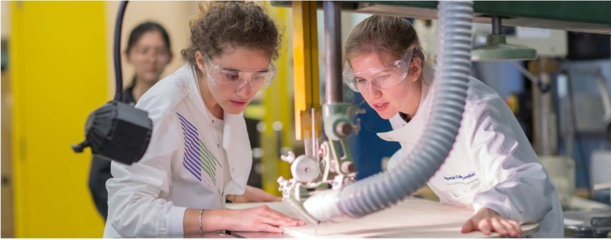

=============
School Spaces
=============

Teaching Spaces
===============

Details of which rooms you need to attend will be clearly listed on your calendar.

The rooms that we will use most frequently are:

| **Studio 3, Level Three, Dyson Building**
| Flat floor teaching space
| (no. 38 on `campus map`_)
|
| **2nd Floor Study Space, Level Two, Dyson Building**
| Flat floor teaching space
| (no. 38 on `campus map`_)
|
| **The Design Library, Level One, Dyson building**
| Tutorial space
| (no. 38 on `campus map`_)
|
| **EEng 114b Electronics Workshop, Electrical and Electronic Engineering Building**
| Lecture theatre and lab spaces
| (no. 16 on `campus map`_)
|
| **266, 252, 254 Roderick Hill Lecture Theatre**
| (no.7 on `campus map`_, please see note: `Finding Roderick Hill Lecture Theatres`_)
|

.. _`campus map`: https://www.imperial.ac.uk/media/imperial-college/visit/public/SouthKensingtonCampus.pdf

Finding Roderick Hill Lecture Theatres
======================================

A lecture theatre that we will be using quite frequently is Roderick Hill 266. This can be a little hard to locate the first time, so there are detailed instructions on how to find the room below. You may also use rooms 252 and 254, which are just around the corner from 266.

.. raw:: html

  

  <a class="btn btn-info btn-custom" href="#" role="button" style="margin-bottom:20px;white-space:normal;">How to find Roderick Hill 266</a>

.. todo:: The above link currently isn't working. It should be fixed shortly.

Social Study Space
==================

From 1200 noon each day, the 2nd Floor Study Space in the Dyson Building is available for all students to use as a communal study/social area.

This area contains PC/laptop benching, comfortable seating, and a kitchen unit.

Meeting Rooms
=============

The School has a number of meeting rooms. You will mostly use these for Personal Tutorials and meetings with academics that they may arrange.

**Student use of meeting rooms** - The meeting rooms are primarily for staff use. They use a booking system and students cannot book them.

You may use an empty meeting room but must leave as soon as you are requested to. You must always leave meeting rooms in a clear and tidy state, otherwise we will revoke all unaccompanied student access to the meeting rooms.

Dyson Building Meeting Rooms
----------------------------

**Trapezoid Rooms 1, 2 & 3** - These three rooms are next to each other on the 2nd Floor of the Dyson Building. They are along the side of the Study Space.

**The Orange Room** - The Orange Room is next to the stairs on the 1st Floor of the Dyson Building. It is next to the Library on the Imperial College Road side of the building.

**Meeting Room 1** - Meeting Room 1 is next to Office 1 on the First Floor, just outside the Design Library. It is on the Exhibition Rd side of the building.

Observatory Building Meeting Rooms
----------------------------------

**Volt & Ohm Rooms** - The Volt and the Ohm Rooms are next to each other on the top floor of the Observatory Building. They are through the PhD offices which do not have general access. You will only be able to access these rooms if the person you are meeting with lets you through the locked doors.

How to find the Observatory Building
------------------------------------

The Observatory Building will eventually be joined via a link bridge to the main Dyson Building. Until then, you need to exit the Dyson Building and walk around the side to enter the Observatory Building.

.. todo:: There is a missing image here showing the entry point to the building.

1. From Imperial College Road take the side road with the zebra crossing on it (opposite Skempton Building).

2. Follow the road as it turns left and slopes down towards the black fire escape on the exterior of the Observatory Building.

.. todo:: There is a missing image here showing the entry point to the building.

3. Take the stairs to the black door on the second landing (DesEng Staff card access needed)

4. Once through the doors, the office doors are straight ahead of you (DesEng Staff card access needed).

Storage
=======

Storage space in the School Workshop is limited. Items may only be stored if, and where, agreed in advance by the Workshop Head Technician and if clearly marked with the owner’s name, the supervisor’s name and relevant contact numbers along with dates defining the period of storage.

Given the range of users and the limited storage facilities, appropriate clearing and cleaning during and after any ACE lab activity is absolutely essential. ACE Workshop staff will inspect daily and tidy as necessary: any items left out will be subject to disposal.

Chemical Storage
----------------

Chemicals cannot be stored in the ACE lab without the prior agreement of the School’s Technicians and the completion and signing off of a COSHH assessment.

**Email Head Technician, Ms. Ingrid Logan: i.logan@imperial.ac.uk**

.. todo:: There is a missing link here to "Download COSHH form"

Project Storage
---------------

In the Breakout Space on 2rd Floor, Dyson Building there are project drawers which will operate on a gym style, first-come-first served basis.

These are managed by the School’s :ref:`student-reps`. If you have any issues with these, you should contact the Reps directly.

Otherwise you will be responsible for storing the necessary books and equipment for your courses and ensuring that you bring the correct items with you to classes and sessions.

.. todo:: There is an image missing here showing an example of student storage space.

School Workshop
===============

The School’s workshop facilities are located on the ground floor of ACE Building (Building no.14 on the `campus map`_).

.. important:: Failure to keep the lab spaces safe and tidy may lead to restrictions in your access to College lab spaces.

**The ACE Lab Project Development Area**

- Bench space, fixed - comprising approximately 20 fixed benches.
- Bench space, flexible - this area has moveable tables, so the area can be set-up to meet the class’s particular needs.

**The ACE Lab Machine Tool Area**

This is a defined space in the ACE Lab providing a machine tools area, resins room and a materials store. The machine tools include:

- Panel saw
- Lathe
- Milling machine
- Band saw
- Pillar drill
- Sanders
- Laser cutter
- CNC router
- Sewing machine
- 3D printing
- CAD-CAM

Full details of these machines are listed in the section `ACE Workshop - Facilities and Services`_.

Workshop Training
-----------------

Before you can use any equipment in any of the Workshops you need to be appropriately trained. Induction sessions are scheduled throughout the MEng course. These are pass/fail and an attendance register will be taken.

Before the ACE Lab induction, all students will have to **complete an online safety test on Blackboard**, of which details will be provided in due course.

Training on specialist machine tools will be provided by the School Head Technician (Ms. Ingrid Logan).

**CAD/CAM** Technical advice on specialist rapid prototyping and CAD-CAM (Computer Aided Design/Manufacture) techniques will be provided by the School Head Technician (Ms. Ingrid Logan).

Workshop Hours
--------------

- **0900-1630 - Weekdays* - Supervised**

  Technical support, supervision and selected power tools will be made available in the ACE Lab Workshop during these hours.

- **0800-2200 - Every day* - Unsupervised**

  Qualified students can access the workshop benches and use hand-tools during these hours.

  .. note:: The workshop is **not** accessible on College closure days (:ref:`college-closure`).

.. important:: It is always your responsibility to return your tools to their storage places after use.

Personal Protective Equipment
-----------------------------

You must wear the following items in the Workshops at all times:

- Sturdy shoes with closed toes
- Safety Glasses
- Boiler suit or lab coat
- Long hair must be tied back at all times
- All jewellery must be taken off

You will be issued with one set of glasses, a boiler suit and a lab coat for free. If you lose these, you will need to need to pay to replace them.

.. raw:: html

  <link rel="stylesheet" href="https://cdnjs.cloudflare.com/ajax/libs/font-awesome/4.7.0/css/font-awesome.min.css">
  

  

    

      
      
Ingrid Logan

      
Head Technician

    

    

      
      
Saadiqah Rahman

      
Technician

    

    

      
      
Gordon Addy

      
Technician

    

    

      
      
Darren Jupp

      
Technician

    

  

Please be courteous and professional to all workshop personnel.

**Ingrid Logan is the safety officer** for this facility and therefore will be ensuring best practice.

Project Work in Research Labs
-----------------------------

College and School health and safety rules dictate that students on taught courses may only work in laboratories during technical staff hours — i.e. between 08:30–17:00, Monday to Friday, while the College is open.

Even outside these hours, no-one is permitted to work alone unless the work has been declared (in writing) to be non-hazardous, and authorised by his or her supervisor and the laboratory manager — otherwise, a second person must be present.

.. note:: For some laboratories, ‘lone working’ permission is never given.

ACE Workshop - Facilities and Services
--------------------------------------

.. contents::
  :local:

General access to workshop
**************************

Students may only use the ACE workshop after completing a safety induction and a recognised period of skills training. Suitable training is provided for all DE1, GID1 and IDE1 as part of the teaching programme. For all others including AME MSc, PhD and Exchange students, training must be organised separately.

Laser Cutting and Etching
*************************

(LaserCam A2 60 W). For light materials such as plywood and MDF up to 6 mm, plastics and acrylics, card etc. No metals.

:Access: Request to Technician. Inductions can be arranged through Head technician. Workshop stocks some materials, students may be required to provide own materials. Supported file format .dxf. Service is free for all DE taught courses.

3D Printing
***********

- Z-Corp - Starch powder and binder visualisation models only. Some post impregnation but low strength.
- Projet - ABS like plastic using wax support. Uses UV curing system.

- Ultimaker 3 – PLA
- Up! Mini 2- ABS

:Access: Request to Technician. Supervisors’ approval is required. Provide .stl file of object. Service is free to all DE taught courses.

  Students that have completed appropriate induction may use these 3D printers during supervised hours.

CNC Router
**********

(Roland) For producing 3D machined models and parts in materials such as tooling board, wood, foam and plastic.

:Access: Request to Technician.

  Provide own materials and .stl file of object. Service is free to all DE taught courses.

Vacuum Forming
**************

Small format vacuum forming in light thermoformable polymers up to 6 mm in thickness.

:Access: Request to Technician.

  Provide own materials and discuss mould tool manufacturing method with technician. Service is free to all DE taught courses.

Resin Room
**********

For working with epoxy resins etc. Any activity requiring ventilation or fume extraction.

:Access: Technician supervised activity, only available during working hours.

  Students must complete short induction and provide COSHH/ MSDS safety data sheets for materials and technical specification sheet.

Toolboxes & Cordless hand tools
*******************************

12 Tool boxes containing a selection of mechanical assembly tools are available.
A selection of cordless tools are available for use. Battery charging points are provided in the store room.

:Access: During supervised hours toolboxes and cordless tools are made available upon request.

  Both items are provided on longer term loans by a booking system. Individuals are then responsible for losses or damage of items.

Dust Extraction
***************

For sanding and shaping material within ACE workshop.

:Access: Workshop has 2 provisions:

  - Downdraught air benches for desktop work must be used for all small and portable objects
  - Portable vacuum units are available for all larger immovable items.

Project Storage
***************

Project work is not to be left out on benches without the explicit permission of the ACE workshop technicians.

:Access: Small storage boxes are provided for all individual and group projects and are allocated on request to a Technician. Rack space is provided for larger format project work.

Consumables & Hand tools
************************

A selection of project assembly consumables such as screws, nails, pins, adhesives, tapes etc. are freely available.
A selection of hand tools are available for use.

:Access: All these items are kept in the central storeroom. The room is open during supervised hours and accessible by door combination outside of supervised hours.

  Door combination number is available upon request.

  .. important:: Do not wedge door open outside supervised hours.

Machine tools
*************

A range of saws, drills, sanders and routers are available.

:Access: All machine tools in the ACE workshops are colour coded:

  **RED spot** |REDSPOT|

  For use only by workshop technicians only (e.g. circular saws, CNC machine tools).

  **AMBER spot** |AMBERSPOT|

  For use by students under the supervision of a technician and after the completion of the necessary training and induction (e.g. band saws, lathes, milling machines).

  **GREEN spot** |GREENSPOT|

  For use by students without the supervision of a technician but after the completion of induction (e.g. Cordless power tools).

