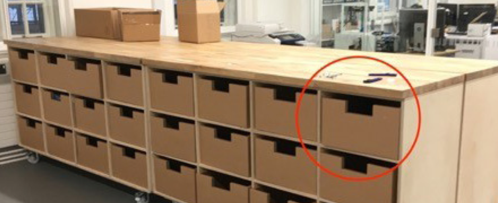
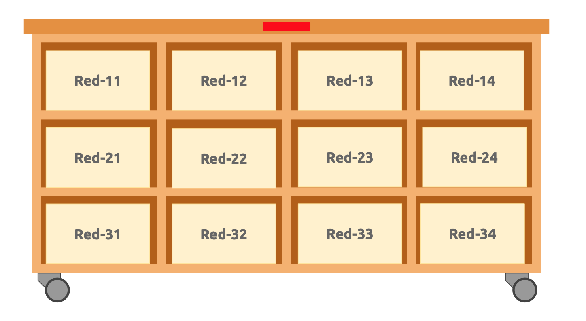

=============
Storage Space
=============

In the Studio space of the 2nd Floor, Dyson Building, there are eight storage units, each with 12 storage boxes, providing a total 96 boxes.

Additionally, there are a number of fully securable lockers that are located at the east end of the basement floor (by the lift) and in the Fusion 54 Cafe on the ground floor.

This storage is managed by the School’s :ref:`student-reps`. If you have any issues with these, you should contact the Reps directly.

Designation of Level 2 Boxes
============================

Each unit of 12 boxes is given a colour code. Each box is identified by its row and column. An example of the red storage unit can be seen in the diagram below.

Each colour is also associated with the name of a famous inventor in history.  The use of names may be changed from time-to-time, but the colour will remain the same from year-to-year so that the designation of the boxes will remain static.

Allocation Policy
-----------------

The Department Representative(s) will be responsible for the allocation of boxes on a termly basis. This may be delegated to another student representative. See the School’s :ref:`student-reps` to contact reps directly.

The purpose of this allocation is:

#. To maximise the usefulness of the storage boxes for short-term storage, i.e. we want to maximise the turnover of the contents.
#. To be as fair to each student as possible.
#. To minimise the process in managing these boxes.

The following allocation rules apply. These will be reviewed termly and adapted as necessary:

#. A limited number of boxes will be allocated to key individuals holding representative and societal roles in the School (e.g. Dep Rep, DesSoc Chair, etc.).
#. Priority will be given to more senior cohorts. This is reasonable because it means junior students will get their priority in later years.
#. Year 1 students living in South Kensington Halls of residence has lowest priority because their proximity of their room to the School building.
#. Priority will be given to students who group up (in threes is advised). This is due to the limited amount of storage.
#. All boxes **must be emptied** a the end of term unless the allocation continues into the next term.

.. button::
   :text: Request a storage box
   :link: https://goo.gl/forms/80F5e6Fxc0ZOiNYb2

Designation of fully securable lockers
======================================

.. todo:: This will be added at a later stage. For queries, please contact the Department Representative (:ref:`student-reps`)

.. button::
   :text: Request a locker
   :link: https://goo.gl/forms/XgVm2LSxm0CMWCxs1
