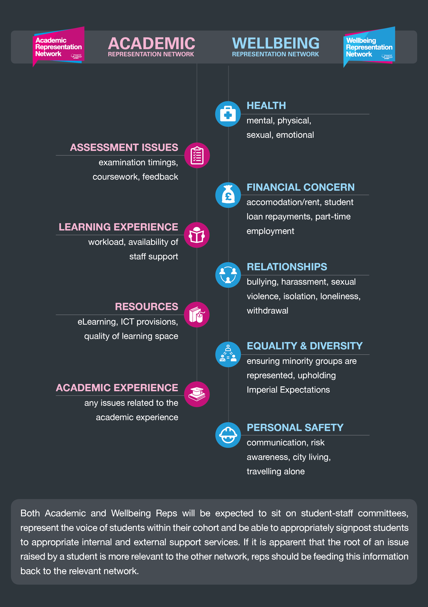

.. _`student-reps`:

=======================
Student Representatives
=======================

In our School, the Union has two Department Reps (one academic and one well-being), and two Year Reps (one academic and one well-being) for each year group.

About the Networks
==================

You can find the description provided by the IC Union of these roles here:

.. raw:: html

  

  <a class="btn btn-info btn-custom" href="https://www.imperialcollegeunion.org/your-union/your-representatives/representation-networks" role="button" style="margin-bottom:20px;white-space:normal;">About the Rep Networks</a>
  

Your Reps
=========

.. raw:: html

  <link rel="stylesheet" href="https://cdnjs.cloudflare.com/ajax/libs/font-awesome/4.7.0/css/font-awesome.min.css">
  

  

    <h3>Department</h3>
    

      
      
Ben Greenberg

      
Department Rep (Academic)

      
<a href="mailto:bsg115@ic.ac.uk">bsg115@ic.ac.uk</a>

    

    

      
      
Ellie Peatman

      
Department Rep (Wellbeing)

      
<a href="mailto:elspeth.peatman16@imperial.ac.uk">elspeth.peatman16@imperial.ac.uk</a>

    

    <h3>Year 4</h3>
    

      
      
Ian Keglar

      
Year 4 Rep (Academic)

      
<a href="mailto:ian.kegler15@imperial.ac.uk">ian.kegler15@imperial.ac.uk</a>

    

    

      
      
Leah Pattison

      
Year 4 Rep (Academic)

      
<a href="mailto:leah.pattison15@imperial.ac.uk">leah.pattison15@imperial.ac.uk</a>

    

    <h3>Year 3</h3>
    

      
      
Gordon Cheung

      
Year 3 Rep (Academic)

      
<a href="mailto:yat.cheung16@imperial.ac.uk">yat.cheung16@imperial.ac.uk</a>

    

    

      
      
Justice Duru

      
Year 3 Rep (Wellbeing)

      
<a href="mailto:justice.duruanyanwu16@imperial.ac.uk">justice.duruanyanwu16@imperial.ac.uk</a>

    

    <h3>Year 2</h3>
    

      
      
Higor Alves De Freitas

      
Year 2 Rep (Academic)

      
<a href="mailto:higor.alves-de-freitas17@imperial.ac.uk">higor.alves-de-freitas17@imperial.ac.uk</a>

    

    

      
      
Amy Mather

      
Year 2 Rep (Wellbeing)

      
<a href="mailto:amy.mather17@imperial.ac.uk">amy.mather17@imperial.ac.uk</a>

    

    <h3>Year 1</h3>
    

      
      
Claudia Regojo Montero

      
Year 1 Rep (Academic)

      
<a href="mailto:claudia.regojo18@imperial.ac.uk">claudia.regojo18@imperial.ac.uk</a>

    

    

      
      
Hind Arekat

      
Year 1 Rep (Wellbeing)

      
<a href="mailto:hind.arekat18@imperial.ac.uk">hind.arekat18@imperial.ac.uk</a>

    

  

   

Election of Department Reps
===========================

The Department Reps are elected via the Union’s eVote service during Term 2.

All UG students will be invited to submit a manifesto online. When submissions close, the eVote system opens and students have a chance to campaign for two weeks to obtain votes, after which the eVote closes. The results are announced shortly after.

Election of Year Reps
=====================

- In week 1 of the autumn term, all UGs will be invited to submit a manifesto.
- At the end of week 1, these manifestos will go live and will be available for their year group to read.
- In week 2, a timetabled session for each year group, coordinated by the Senior tutor, will be used to collect votes. The reps for the respective year group will be announced at the end of the session.
