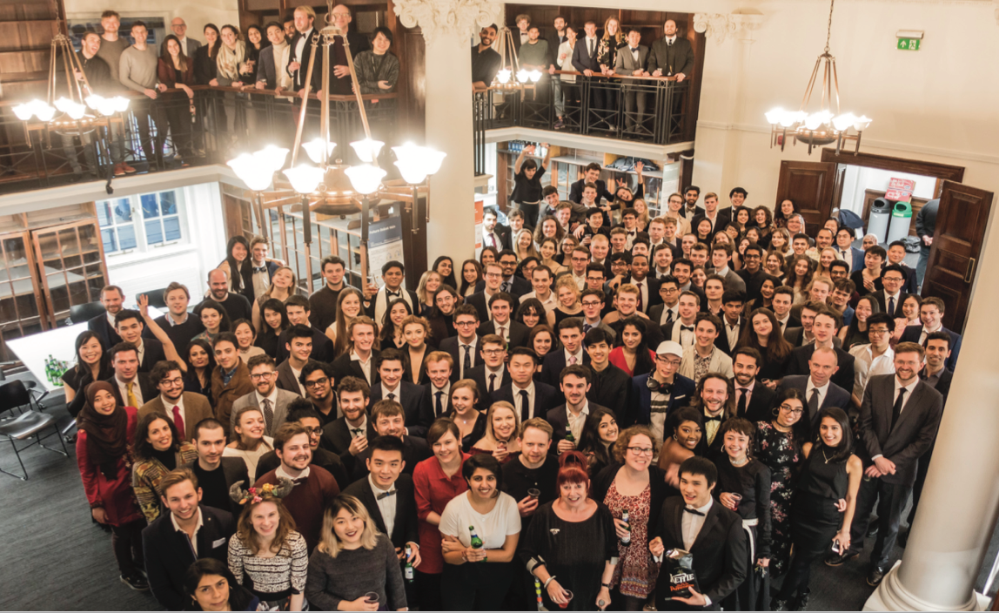

=======
Welcome
=======

Welcome to the College
======================

Congratulations on joining Imperial College London, the
only university in the UK to focus exclusively on science,
medicine, engineering and business.

From Fleming’s discovery of Penicillin to Gabor’s invention
of holography, Imperial’s has been changing the world for
well over 100 years.

You’re now very much a part of this community of
discovery and we hope you will take this opportunity to
make your own unique contribution.

We’re committed to providing you with the very best
academic resources to help you reach your true potential.
We also provide a dedicated support network and a range
of specialist support services to make sure you have
access to the appropriate help, whether that’s further
training in an academic skill like note taking or simply
having someone to talk to.

We actively encourage you to seek out help when you
need it and try to maintain a healthy work-life balance.
Our choice of over 340 clubs, societies and projects is
one of the largest of any UK university, making it easy to
do something different with your downtime. You also
have free access to gym (following a one-off orientation
fee of £40 in 2017) and swimming facilities across our
campuses.

Welcome from the Head of School
===============================

|
|  The MEng in Design Engineering helps you develop a
|  diversity of skills and expertise. We are excited at the
|  opportunity of working with you over the coming years as
|  you enter the world of design engineering and contribute
|  towards the development of society and the domain.
|
|  This document serves a number of purposes including
|  helping to introduce you to key information which will be
|  helpful during the welcome week and as you settle in. In
|  addition the document provides an overview of the MEng
|  in Design Engineering which will be useful throughout
|  your degree programme. The document has been
|  developed with input from several staff members and is
|  updated regularly so do source the online version for the
|  latest information.
|
|  As a student of Imperial College London, the Students’
|  Union, fellow students, social media and staff are all part
|  of your new network and we encourage you to engage
|  with all of these, and we also encourage you to seek out
|  the staff with your queries – it’s what we are here for.
|  Welcome to the MEng in Design Engineering.
|
|  All the best,
|  Professor Peter Childs
|  Head of Design Engineering
|

Meet the School Teaching Staff
==============================

.. todo:: Need to complete this for all staff members. Currently only have a random selection for demo.

.. note:: School staff profiles can be customised into any custom format. This one dynamically moves around with the size of the screen and can provide easy direct links to opening a new email with a member of staff.

.. raw:: html

  <link rel="stylesheet" href="https://cdnjs.cloudflare.com/ajax/libs/font-awesome/4.7.0/css/font-awesome.min.css">
  

  

    

      
      
Prof. Peter Childs

      
Head of School

      
<a ref="mailto:p.childs@imperial.ac.uk"><i class="fa fa-envelope"></i> Email</a>

    

    

      
      
Dr Weston Baxter

      
Lecturer

      
<a ref="mailto:weston.baxter@imperial.ac.uk"><i class="fa fa-envelope"></i> Email</a>

    

    

      
      
Andrew Brand

      
Principal Teaching Fellow

      
<a ref="mailto:andrew.brand@imperial.ac.uk"><i class="fa fa-envelope"></i> Email</a>

    

    

      
      
Prof. Peter Cheung

      
Professor

      
<a ref="mailto:p.cheung@imperial.ac.uk"><i class="fa fa-envelope"></i> Email</a>

    

    

      
      
Dr Sam Cooper

      
Lecturer

      
<a ref="mailto:samuel.cooper@imperial.ac.uk"><i class="fa fa-envelope"></i> Email</a>

    

    

      
      
Aran Dasan

      
Senior Teaching Fellow

      
<a ref="mailto:a.dasan@imperial.ac.uk"><i class="fa fa-envelope"></i> Email</a>

    

    

      
      
Dr Bruce Garvey

      
Visiting Teaching Fellow

      
<a ref="mailto:b.garvey12@imperial.ac.uk"><i class="fa fa-envelope"></i> Email</a>

    

    

      
      
Dr Mazdak Ghajari

      
Lecturer

      
<a ref="mailto:m.ghajari@imperial.ac.uk"><i class="fa fa-envelope"></i> Email</a>

    

  

Feel free to get in contact with the member of staff you need.
