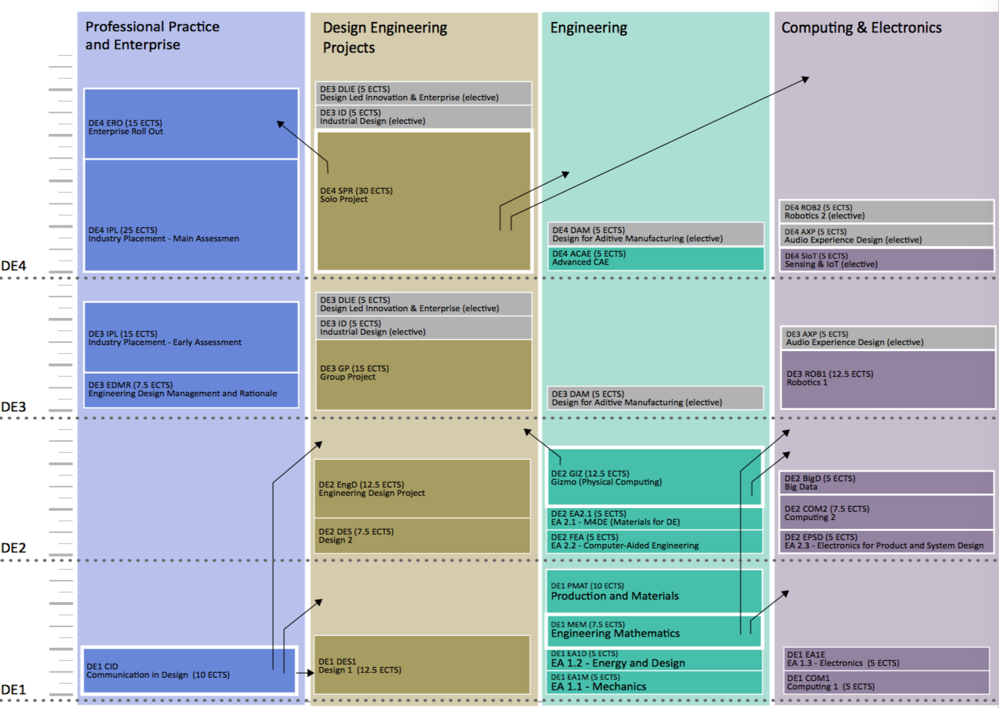

============
Year by Year
============

Key Dates and Attendance
========================

The College has both a duty of care towards its students, and regulations to ensure that they follow the prescribed programme of studies. For these and other reasons there are a number of points during the year at which your absence will be reported to the Senior Tutor.

Attendance is monitored at:

- Personal tutorials
- Lab/exercise/tutorial sessions
- Workshop assignments
- All coursework submissions are registered.

Term Dates
----------

.. list-table::
  :widths: 5 10 10 10
  :header-rows: 1

  * - **Academic Year**
    - **Autumn Term**
    - **Spring Term**
    - **Summer Term**
  * - **2017 - 2018**
    - 30 September - 15 December
    - 6 January - 23 March
    - 28 April - 29 June
  * - **2018 - 2019**
    - 29 September - 14 December
    - 5 January - 22 March
    - 27 April- 28 June
  * - **2019 - 2020**
    - 28 September - 13 December
    - 4 January - 20 March
    - 25 April - 26 June

.. button::
   :text: Future Term Dates
   :link: https://www.imperial.ac.uk/admin-services/registry/term-dates/

.. _`college-closure`:

Closure Dates
-------------

.. list-table::
  :widths: 5 10
  :header-rows: 1

  * - **Holiday**
    - **Dates**
  * - **Christmas/New year**
    - 24 December 2017 - 1 January 2018 (College reopens on 2 January 2019)
  * - **Easter holiday**
    - 18 April – 23 April 2019 (College reopens on 24 April 2019)
  * - **Early May bank holiday**
    - 6 May 2019
  * - **Spring bank holiday**
    - 27 May 2019
  * - **Summer bank holiday**
    - 26 August 2019

.. button::
   :text: Future College Closure Dates
   :link: https://www.imperial.ac.uk/admin-services/registry/term-dates/

.. important:: For all coursework submission deadlines, key dates and late-breaking news associated with specific modules, please check the calendar on the corresponding BlackBoard page.

You are required to attend College until the end of session because the External Examiners may wish to interview you during the last week. You should therefore avoid any commitment — other than those forming part of the course — which could prevent you attending College during term-time.

Term Structure
--------------

Design Engineering has teaching across all three terms. We also have exams throughout the year, rather than in one session at the end of the year.

**Terms 1 & 2**

.. list-table::
  :widths: 5 10
  :header-rows: 1

  * - **Week**
    - **Activity**
  * - 1
    - Welcome Week (T1)
      Exams (T2)
  * - 2-5
    - Teaching
  * - 6
    - DRAW week
  * - 7-10
    - Teaching
  * - 11
    - Supplementary activities

**Terms 3**

.. list-table::
  :widths: 5 10
  :header-rows: 1

  * - **Week**
    - **Activity**
  * - 1
    - Exams & Teaching
  * - 2-7
    - Teaching
  * - 8
    - Teaching/Assessments
  * - 9
    - Exams/Assessments

.. important:: There will be scheduled mandatory activities throughout the first and last weeks of every term. **You are expected to be available to attend School from the first day of term to the last.**

What is DRAW Week?
------------------

DRAW stands for Design, Review, Applications and Workshops.

During DRAW Weeks there will be a variety of one-off activities timetabled. Some of these will be directly related to your current studies and some of them will be looking beyond the curriculum.

DRAW Week is a busy week and all of the sessions are mandatory.

.. important:: DRAW Weeks are not traditional ‘Reading Weeks’ – you will not have the chance for trips away from College during this time.

Interruption of Studies
=======================

The DE MEng programme, its examination and assessment structure and its marking scheme are designed for continuous attendance. Interruption of Studies — effectively, temporary withdrawal — can be arranged for on medical, financial or personal grounds, but can create significant problems especially for international students.

If you wish to take time out from your course of study, speak to your personal tutor first. S/he will refer you to Dr Lorenzo Picinali (who is the Interruptions Officer).

It is important for us to understand your particular case and all aspects of why you wish to take the ‘gap’. If your plans are to work, for example, there may be options for integrating them with your current degree programme or for transferring to another.

Temporarily ceasing to be a student can create significant problems: details of these are given on the Registry website.

.. button::
   :text: Registry Information on Interruption of Studies
   :link: http://www.imperial.ac.uk/student-records-and-data/for-current-students/undergraduate-and-taught-postgraduate/changes-to-registration-status/

Degree Overview
===============

A schematic overview of the academic curriculum is given in :ref:`appendix-module-gantt`.

Every teaching and learning activity is part of a module, which is taught in a specific year of the course (DE1 to DE4). These are grouped in board themes, listed below.

- Design
- Design engineering project
- Engineering
- Transferrable skills
- Enterprise

Each module is self-contained and separately assessed although, of course, its subject matter will be linked to that of other modules.

.. note:: As the MEng Design Engineering is a new course, information regarding subsequent years is subject to change.

In addition the programme includes a diverse range of electives, some run by other departments, some run by the Dyson School of Design Engineering and open to students from other departments. These modules offer a crucial opportunity for interdisciplinary experience and activities.

A key activity in the programme is the extensive project work, some in combination with students from other departments, which is undertaken in each of the years, enabling implementation of material covered in the modules as well as project based learning of key technologies.

The programme has a diversity of means of assessment with a particular emphasis on project work, assignments and coursework as opposed to examinations. The project work focus enables students with particular requirements to schedule their efforts according to their particular needs. Several electives are available in years three and four, permitting students to adjust the focus of their studies as they progress, and the intention is to make further elective modules available as the School develops.

Modules Year by Year
====================

The First Year
--------------

The programme commences with key foundational skills and knowledge building in design and engineering fundamentals. Beginning with induction projects, the novice design engineer’s experience of the design process is steadily developed through a series of design engineering projects, enabling the student to see the practical application of content introduced in other modules as well as developing their own individual experience base and design process, communication and project management skills.

.. raw:: html

  

    <table border="1" cellpadding="5" style="border: 1px solid black; width:100%; min-width:600px;">
      <colgroup>
        <col span="1" style="width: 15%;">
        <col span="1" style="width: 30%;">
        <col span="1" style="width: 50%;">
        <col span="1" style="width: 5%;">
      </colgroup>
      <tr bgcolor="#B0B1AF">
        <th>Theme</th>
        <th>Title</th>
        <th>Description</th>
        <th>Compulsary/Elective</th>
      </tr>
      <tr>
        <td bgcolor="#FFF101">Engineering</td>
        <td >Engineering Mathematics</td>
        <td >Engineering mathematics for design engineering</td>
        <td >Compulsory</td>
      </tr>
      <tr>
        <td bgcolor="#D8127D">Professional Practice & Enterprise</td>
        <td >Communication in Design</td>
        <td >Presentation and technical communication skills, in combination with development of visual communication skills</td>
        <td >Compulsory</td>
      </tr>
      <tr>
        <td bgcolor="#FFF101">Engineering</td>
        <td >Production and Materials</td>
        <td >Introduction to production and manufacturing resources</td>
        <td >Compulsory</td>
      </tr>
      <tr>
        <td bgcolor="#BD252C">Design Engineering projects</td>
        <td >Design 1</td>
        <td >Exploring the integration of design engineering tools to deliver effective design, introduction to design engineering research</td>
        <td >Compulsory</td>
      </tr>
      <tr>
        <td bgcolor="#FFF101">Engineering</td>
        <td >Engineering Analysis 1.1 Mechanics</td>
        <td >Development of fundamental skills in Mechanics and Dynamics for Design</td>
        <td >Compulsory</td>
      </tr>
      <tr>
        <td bgcolor="#FFF101">Engineering</td>
        <td >Engineering Analysis 1.2 Energy and Design</td>
        <td >This module covers an introduction to the principles of thermodynamics, energy, fluids mechanics and heat transfer from a design perspective.</td>
        <td >Compulsory</td>
      </tr>
      <tr>
        <td bgcolor="#00A3DA">Computing & Electronics</td>
        <td >Engineering Analysis 1.3 Electronics</td>
        <td >Development of fundamental skills in Electronics</td>
        <td >Compulsory</td>
      </tr>
      <tr>
        <td bgcolor="#00A3DA">Computing & Electronics</td>
        <td >Computing 1</td>
        <td >This module is designed to be a first introduction to computer programming.</td>
        <td >Compulsory</td>
      </tr>
    </table>
  

  

Second and Third Years
----------------------

In the second and third years, the range of engineering fundamentals, design thinking, creative problem solving, management and communication skills are developed, leading to a series of enterprise modules and projects where students develop skills in value propositions and turning their concepts into embodied concepts and proposals that are suited to corporate and enterprise roll-out. Students going onto the fourth year will then take part in a six-month industrial placement intended to give them real commercial experience and an opportunity to put the skills they have acquire to practice.

Second Year
***********

.. raw:: html

  

    <table border="1" cellpadding="5" style="border: 1px solid black; width:100%; min-width:600px;">
      <colgroup>
      <col span="1" style="width: 15%;">
      <col span="1" style="width: 30%;">
      <col span="1" style="width: 50%;">
      <col span="1" style="width: 5%;">
      </colgroup>
      <tr bgcolor="#B0B1AF">
        <th>Theme</th>
        <th>Title</th>
        <th>Description</th>
        <th>Compulsary/Elective</th>
      </tr>
      <tr>
        <td bgcolor="#FFF101">Engineering</td>
        <td >Gizmo (Physical Computing)</td>
        <td >Development of key skills in machine elements and physical computing</td>
        <td >Compulsory</td>
      </tr>
      <tr>
        <td bgcolor="#FFF101">Engineering</td>
        <td >Engineering Analysis 2.1 - Mechanics for Design Engineering</td>
        <td >Development of in-depth skills in Advanced Mechanical Analysis</td>
        <td >Compulsory</td>
      </tr>
      <tr>
        <td bgcolor="#FFF101">Engineering</td>
        <td >Engineering Analysis 2.2 - Computer-Aided Engineering</td>
        <td >Development of in-depth skills in Finite Element Analysis</td>
        <td >Compulsory</td>
      </tr>
      <tr>
        <td bgcolor="#00A3DA">Computing & Electronics</td>
        <td >Engineering Analysis 2.3 - Electronics for Product and System Design</td>
        <td >Development of in-depth skills in Electronics for Product and System Design</td>
        <td >Compulsory</td>
      </tr>
      <tr>
        <td bgcolor="#00A3DA">Computing & Electronics</td>
        <td >Computing 2</td>
        <td >Software Implementation and Engineering</td>
        <td >Compulsory</td>
      </tr>
      <tr>
        <td bgcolor="#00A3DA">Computing & Electronics</td>
        <td >Big Data</td>
        <td >Introduction to statistical analysis, sensitivity coefficients and practical data analysis and “big-data” tools.</td>
        <td >Compulsory</td>
      </tr>
      <tr>
        <td bgcolor="#BD252C">Design Engineering projects</td>
        <td >Design 2</td>
        <td >Exploring the use of design engineering principles to deliver technical function, aesthetic function, social function, economic functional and psychological function</td>
        <td >Compulsory</td>
      </tr>
      <tr>
        <td bgcolor="#BD252C">Design Engineering projects</td>
        <td >Engineering Design Project</td>
        <td >Design project exploring the application of skills acquired to deliver combined technical, aesthetic, economic and social function</td>
        <td >Compulsory</td>
      </tr>
    </table>
  

  

Third Year
**********

.. raw:: html

  

    <table border="1" cellpadding="5" style="border: 1px solid black; width:100%; min-width:600px;">
      <colgroup>
        <col span="1" style="width: 15%;">
        <col span="1" style="width: 30%;">
        <col span="1" style="width: 50%;">
        <col span="1" style="width: 5%;">
      </colgroup>
      <tr bgcolor="#B0B1AF">
        <th>Theme</th>
        <th>Title</th>
        <th>Description</th>
        <th>Compulsary/Elective</th>
      </tr>
      <tr>
        <td bgcolor="#D8127D">Professional Practice & Enterprise</td>
        <td >Enterprise Management</td>
        <td >Management principles, project management, business measures, Problem structuring, problem structuring tools, decision rationale</td>
        <td >Compulsory</td>
      </tr>
      <tr>
        <td bgcolor="#00A3DA">Computing & Electronics</td>
        <td >Robotics</td>
        <td >Introduction to robotics, sensors and actuators, control</td>
        <td >Compulsory</td>
      </tr>
      <tr>
        <td bgcolor="#BD252C">Design Engineering projects</td>
        <td >Group Project</td>
        <td >Engineering design group project/interdisciplinary group project</td>
        <td >Compulsory</td>
      </tr>
      <tr>
        <td bgcolor="#D8127D">Professional Practice & Enterprise</td>
        <td >Industry Placement A</td>
        <td >6 month Industry Placement</td>
        <td >Compulsory</td>
      </tr>
      <tr>
        <td ></td>
        <td >Y3 Elective 1</td>
        <td rowspan="2">Available DE Elective modules can be found <a href="http://www.imperial.ac.uk/design-engineering/study/meng/modules/">here</a></td>
        <td >Elective</td>
      </tr>
      <tr>
        <td ></td>
        <td >Y3 Elective 2</td>
        <td >Elective</td>
      </tr>
    </table>
  

  

Fourth Year
-----------

The fourth year offers several electives, allowing a greater degree of specialisation to students than earlier years. The fourth year also contains a high proportion of the programme’s commercially oriented modules; this was designed to consolidate the students’ industrial placement experiences with their previous academic studies and invest students with the skills in enterprise and design in commercial contexts that the programme aims to provide its graduates.

.. raw:: html

  

    <table border="1" cellpadding="5" style="border: 1px solid black; width:100%; min-width:600px;">
      <colgroup>
        <col span="1" style="width: 15%;">
        <col span="1" style="width: 30%;">
        <col span="1" style="width: 50%;">
        <col span="1" style="width: 5%;">
      </colgroup>
      <tr bgcolor="#B0B1AF">
        <th>Theme</th>
        <th>Title</th>
        <th>Description</th>
        <th>Compulsary/Elective</th>
      </tr>
      <tr>
        <td bgcolor="#D8127D">Professional Practice & Enterprise</td>
        <td >Industry Placement B</td>
        <td >6 month Industry Placement</td>
        <td >Compulsory</td>
      </tr>
      <tr>
        <td bgcolor="#BD252C">Design Engineering projects</td>
        <td >Solo Project</td>
        <td >Major Design Engineering Individual Project</td>
        <td >Compulsory</td>
      </tr>
      <tr>
      <td bgcolor="#00A3DA">Computing & Electronics</td>
      <td >Sensing and the Internet of Things</td>
      <td ></td>
      <td >Compulsory</td>
      </tr>
      <tr>
        <td bgcolor="#D8127D">Professional Practice & Enterprise</td>
        <td >Enterprise Roll Out</td>
        <td >Development of an value proposition for a practical enterprise and roll out</td>
        <td >Compulsory</td>
      </tr>
      <tr>
        <td bgcolor="#FFF101">Engineering</td>
        <td >Optimisation</td>
        <td >Introduction to optimisation and development of practical skills in optimisation</td>
        <td >Compulsory</td>
      </tr>
      <tr>
        <td ></td>
        <td >Y4 Elective 1</td>
        <td rowspan="2">Available DE Elective modules can be found <a href="http://www.imperial.ac.uk/design-engineering/study/meng/modules/">here</a></td>
        <td >Elective</td>
      </tr>
      <tr>
        <td ></td>
        <td >Y4 Elective 2</td>
        <td >Elective</td>
      </tr>
    </table>
  

  

Industrial Placement
====================

Students going onto the third and fourth year of the DE MEng take part in a six-month industrial placement intended to give real commercial experience and an opportunity to put the skills acquired into practice.

The placements will run April–September in the third year. Third year exams will be taken early to ensure that all students will be present in College. The School’s Placements Officer, `Talya Porat <https://www.imperial.ac.uk/people/t.porat>`_ (t.porat@imperial.ac.uk) and The UG office will arrange and select a number of appropriate placement companies and industrial supervisors. These will be prepared to provide suitably challenging and well-defined project objectives to students. Companies will be generally expected to pay the students at a level appropriate for a new graduate.

Arranging your placement
------------------------

During Year 2, sessions will be run with the placement officer to inform you of the placements procedure. Attendance at these sessions is mandatory.

The school will provide a list of companies and pre-agreed placements through an online portal. Students will need to find adverts of interest to them, and then go through the company’s individual application and interview process to secure their placement. Students will also be able to source a position with a company not offered by the College, however, this will need to be approved with the School’s Placements Officer to ensure it is appropriate for the learning outcomes.

Supervision and Assessment
--------------------------

Students will have one placement tutor (School academic) and one industrial supervisor (a member of staff at the host company). The module will be assessed against objectives by their placement tutor on the basis of an interim and final report, a presentation, an exhibition, and an employer’s report from the industrial supervisor.

Preparation
-----------

In preparation for your placement it is important that you develop your skills-base in areas relevant to employment and your CV and portfolio. We strongly encourage students to ensure that they manage their projects effectively in DE1, DE2 and DE3 as well as extra-curricular activities and capture the outputs and work for inclusion in your portfolio and CV.

.. important::
  Unless your industry placement is based in London, you will only need accommodation during T1 and T2 of Year 3. The duration of your placement also means that you will will be working during the summer break between the third and fourth years.

Further information
-------------------

Early in your Third Year, you will be provided with a separate handbook that contains the most update information on the placement details for your year.

Teaching Themes
===============

This diagram displays the DE MEng modules organised by teaching themes. Each theme represents a regular forum for the teaching and other relevant staff to discuss and progress all aspects of quality enhancement for their suite of modules. Combining modules into themes aims to facilitate sharing of best practice in teaching and learning and strong vertical co-ordination of curricula and related teaching and learning practice.

Furthermore, this diagram helps understand the relationships between the various modules not just in terms of subject areas, but also in terms of interlinks (knowledge, skills, etc.) between them.

Graduation
==========

With your final-year taught modules examined and your project work written up and presented, the degree programme is over. Academic and administrative staff now integrate all of the module marks and any other relevant information to decide, at a final meeting, the degree class to award.

The Board of Examiners
----------------------

The Board of Examiners consists of every academic member of staff plus an external examiner.

There are two meetings interspersed with fact-finding activities and reviews, this procedure leads to a final mark for graduating students and to a decision on progression for all others.

The process begins with the collection of all marks registered during the year for every student. Checks are made at this stage to ensure that each student has a mark for each module for which s/he was registered.

Verified marks are next input to a master database which contains the marks brought forward from previous years for each registered student. Finally a program which implements the progression rules for each student’s year of entry is run to update the database and arrive at a mark for the current year.

A Pre-Exam Board Meeting, attended by a core group of academics and administrators including the Examinations Officer and DUGS, takes an overview of the year’s results. Special cases are discussed and exam or coursework marks for modules which may require moderation are identified. The group considers preliminary outcomes for individual students. In particular, College regulations require every candidate who is within 2.5% of a degree class boundary (e.g. who has a mark between 67.5% and 70%) to be considered for promotion. This is increased to 5% where mitigating circumstances are taken into account.

The External Examiners — senior academics from another UK university — now arrive.

They spend a day reviewing all marked examination scripts and coursework marked during the year, concentrating on individual project reports and group project results for students who might be considered for degree class promotion. The Pre Exam Board Meeting and the External Examiners’ visit ensure that all relevant information is reviewed in preparation for the Final Board of Examiners Meeting.

.. important:: The External Examiners may decide, for any reason, that they wish to interview a student in person.

The Final Board of Examiners Meeting is attended by all academic staff (who assess students and are therefore ‘Examiners’), the External examiners and a representative from Registry to advise on procedures and regulations. This is the occasion on which the recommendation for degrees and degree classes (honours) are formally agreed. At this point a decision is made on whether a student passes/fails a year or will be required to take a Supplementary Qualifying Test (SQT)

A decision is also made on:

- Whether to carry the information forward to the following year
- Whether a graduating student is awarded an appropriate compensation in marks.

.. note:: At no stage is the proportion of results in each degree class used to implement a ‘quota’, or taken into account in any way at all. In theory every student could get a first!

The Graduation Ceremony
-----------------------

On what the College calls Commemoration Day in late October after your final year, you will arrive at the graduation ceremony as an undergraduate, participate as a graduand and emerge as a graduate.

Invitations are issued during August. The ceremony takes place in the Royal Albert Hall.

Attendance is not required — your degree will be awarded anyway — but few graduands manage to resist the allure of the occasion and the pressure of family and peers.

.. button::
   :text: Graduation website
   :link: http://www.imperial.ac.uk/graduation/
